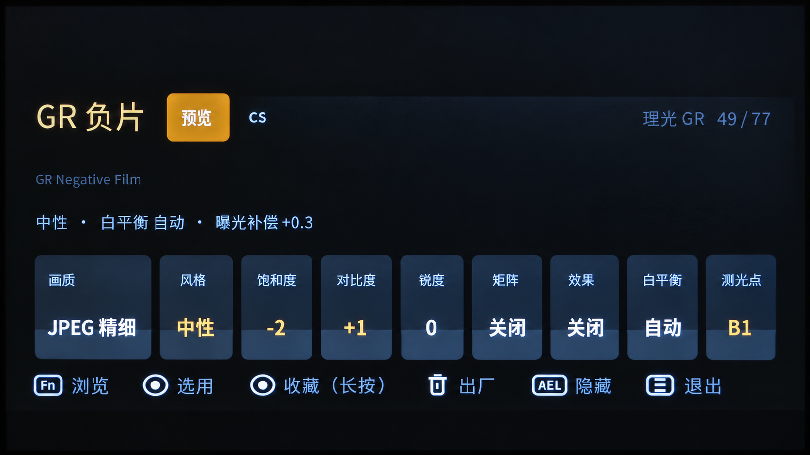
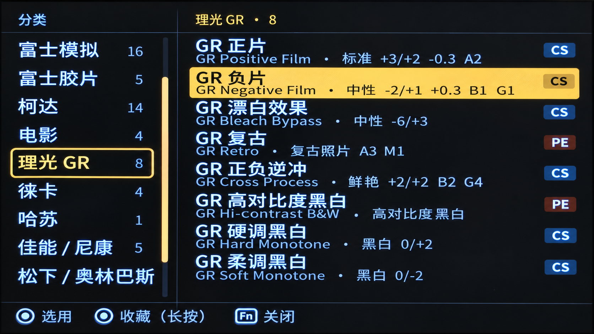

# Localization

Recipe Lab follows the camera's system locale. English is the source and fallback language; the first translated release supports Simplified Chinese for mainland China, Traditional Chinese for Taiwan, China, and a separate Traditional Chinese resource entry for Hong Kong, China. The Hong Kong entry initially reuses the Taiwan translation so it can diverge later without changing Java code.

This is a general localization layer for Recipe Lab, not a NEX-specific edition. Model-specific input adaptation is a separate follow-up concern. The NEX-5R report below is one hardware data point, not the definition of the supported audience or a claim that all bodies have been verified.

User-facing language labels are:

- English
- 简体中文（中国大陆）
- 中国台湾（繁体）
- 中国香港（繁体，首版复用中国台湾译文）

There is no in-app language switch. Android selects the matching resources automatically and falls back to `res/values/` when a translation is absent.

## Architecture

All user-facing text has a stable resource key. Camera-free classes depend on the small `TextCatalog` interface and never import `android.*`; the Android adapter resolves those keys from the standard resource directories:

- `res/values/` — English source and fallback
- `res/values-zh-rCN/` — Simplified Chinese, mainland China
- `res/values-zh-rTW/` — Traditional Chinese, Taiwan, China
- `res/values-zh-rHK/` — Traditional Chinese, Hong Kong, China

Recipe names keep their existing English `Recipe.name` value as a stable identifier. Favourites, sample manifests, compatibility data, and tests continue to use that value. A localized display name is resolved separately, so changing languages never invalidates saved favourites.

## Translation style

- Translate controls, status messages, setting names, and generic photographic terms fully.
- Prefer terminology used by official Chinese camera interfaces over literal translation.
- Make the Chinese recipe name primary. Keep the English canonical name as a smaller secondary label when the localized name differs.
- Preserve brands, product names, film stocks, abbreviations, and technical tokens where translating them would make recognition harder, for example `柯达 Portra 400`, `RAW`, `JPEG`, `DRO`, and `EV`.
- Keep format placeholders unchanged. A translation check verifies that every locale has the same keys and compatible placeholders as English.
- Do not translate camera parameter keys, settings-store identifiers, filenames, or machine-readable sample manifests.

## Typography

Older Sony camera firmware cannot be assumed to contain Chinese glyphs. The APK therefore bundles compact, redistributable Simplified Chinese and Traditional Chinese font subsets containing every glyph used by the shipped translations. A central typeface loader selects the regional glyph forms, then applies them to Android `TextView` instances and custom Canvas text. If the asset cannot be loaded, the app falls back to the system typeface instead of failing to start.

The full font license and pinned source details are included with the asset. Any change to translated text must run `python tools/subset_font.py` to regenerate the subsets so all used glyphs remain present.

## Adding another language

1. Copy both English text resource files, `res/values/strings.xml` and `res/values/ui.xml`, into the appropriate Android locale directory, such as `res/values-ja/`. No changes to recipe identifiers or camera logic are needed.
2. Translate only user-facing values. Keep every resource name and format placeholder unchanged.
3. Extend the locale coverage in `test/com/voxivoid/recipelab/TranslationResourcesTest.java` for the new language, then run `tools/test.sh` to check missing keys and placeholder mismatches. Keep the Chinese regional-font checks limited to Chinese locales; add an equivalent glyph check if the new language bundles its own font.
4. If the language needs glyphs not provided by the camera, extend or replace the bundled font asset and retain its license.
5. Build the APK and inspect the main panel, recipe browser, prompts, developer menu, and transient status messages at the camera's display size.

## Verification boundary

Automated checks cover resource completeness, placeholder compatibility, stable recipe identifiers, language-independent favourites, and pure formatting logic. The build targets Android 2.3/API 10 and verifies the APK signature from API 10 onward. Compilation and signature verification do not establish runtime compatibility: a real Sony camera is still required to confirm installation, physical-key navigation, glyph rendering, and application of a recipe to the settings store.

Use Android `apksigner` (or its `apksig` library) for signing and verification, as the build scripts do. A modern JDK's `jarsigner` can create a v1 signature with signed attributes that Android versions below API 19 reject, even when `jarsigner -verify` succeeds. Always check a distributed APK with `apksigner verify --min-sdk-version 10 --verbose RecipeLab.apk`; generic JAR signature verification is insufficient.

### Initial device report

On 2026-09-26, a contributor confirmed installation and basic use of the localized APK on a Sony NEX-5R with firmware 1.00 after the API 10 signature correction. This does not yet establish recipe persistence after a power cycle, an A6000 test, or separate on-device coverage of every Chinese locale. These remain to be verified.

The following images were supplied by the contributor from their camera test. They show the Simplified Chinese main panel and recipe browser; they do not establish Traditional Chinese verification.

### Known limitations and follow-up scope

- **NEX controls:** the UI still shows the upstream Fn/AEL controls. Dedicated NEX-5R key mapping has not been implemented; successful installation must not be read as complete model support.
- **Overlay usability:** the tester reports that the selection panel occupies roughly two-thirds of the screen and remains visible while shooting. Whether hiding is inaccessible because of the current key mapping or requires a separate behavioral change is not yet established. A still image cannot determine the shutter or hide behavior.
- **More languages:** Japanese and German are intended follow-up translations using the same resource interface. They are not included in this release.

These follow-ups are outside the current localization change and have no promised release date. Camera input behavior and a more compact/shooting-aware overlay should be validated independently of adding languages.
