# 配方样片

77 个配方拍摄同一场景，使用相同光线和固定曝光。照片来自上游原始样片，中文分支仅翻译说明和名称，没有修改照片。

每个配方一张，由应用的批量拍摄功能依次切换配方、等待预览稳定后拍摄。展示文件缩放至宽 900 像素，使用 Lanczos、JPEG 质量 82、无色度抽样并保留 EXIF，没有额外调整颜色。上游未在仓库中提供约 500 MB 的全尺寸原片。

拍摄条件：ILCE-6001、固件 v3.21、三脚架、傍晚室内，固定 **1/30 秒、f/4.5、ISO 250、27 mm**。白平衡遵循各配方，其中 69 个为自动，8 个为固定色温。这是上游记录，不是本次 A5100 实拍。

场景包含橙色、绿色、青色及灰地面和白墙，可比较饱和度、对比度与偏色。但没有真实肤色、树叶和天空，不适合单凭它判断人像配方。固定色温的配方也会受室内光源影响，建议在自己的拍摄环境中预览。

参数按「风格 饱和度／对比度」排列。MTX 表示色彩矩阵，EV 表示曝光补偿，DRO 表示动态范围优化，K 表示色温；A／B 表示琥珀／蓝偏移，G／M 表示绿／品红偏移。照片效果配方显示效果名。

[返回中文 README](../README.md) · [配方名称对照](RECIPES.zh-CN.md) · [英文样片说明](SAMPLES.en.md)

## 索尼

### 01 · 标准出厂 ST

`标准  0/0`

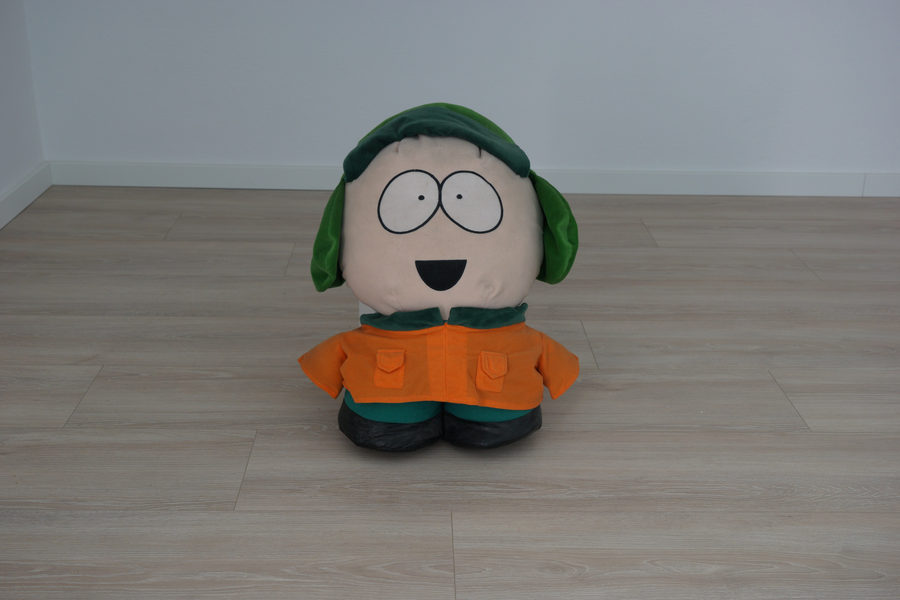

### 02 · 索尼 PT 人像

`人像  0/0`

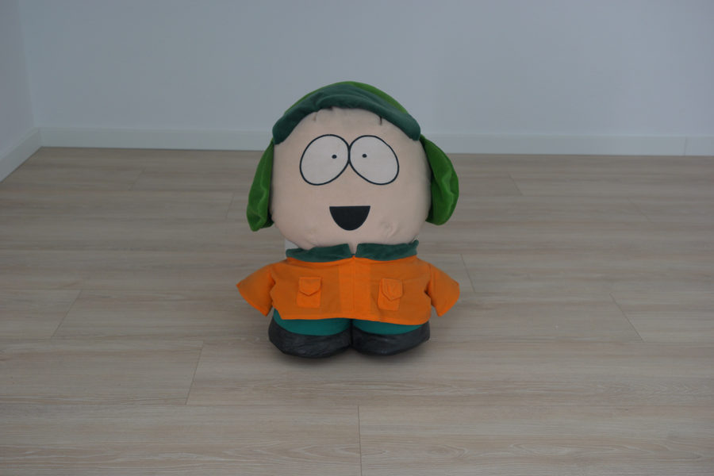

### 03 · 索尼 NT 中性

`中性  0/0`

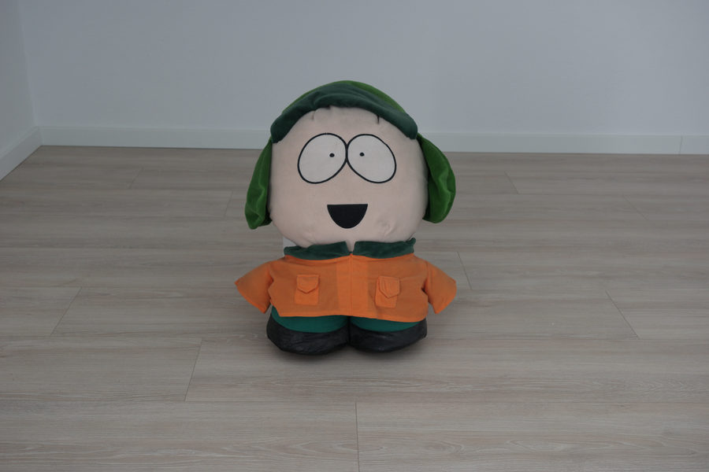

### 04 · 索尼 VV 鲜艳

`鲜艳  0/0`

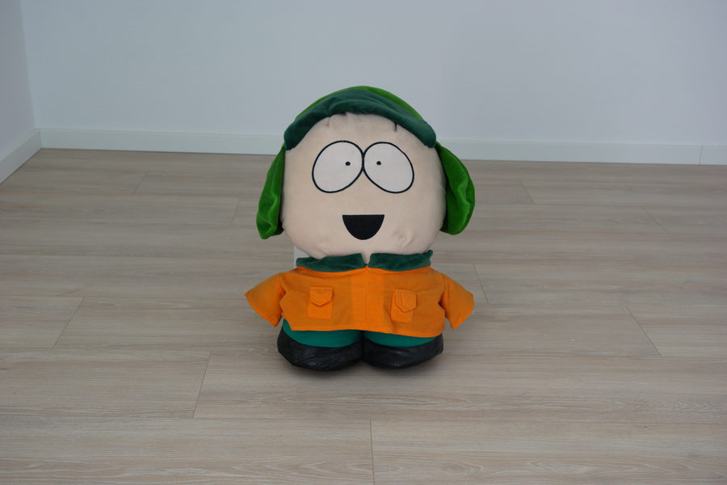

### 05 · 索尼 VV2 浓艳

`鲜艳  +2/+1  MTX`

### 06 · 索尼 FL 胶片

`中性  -4/-1  A1`

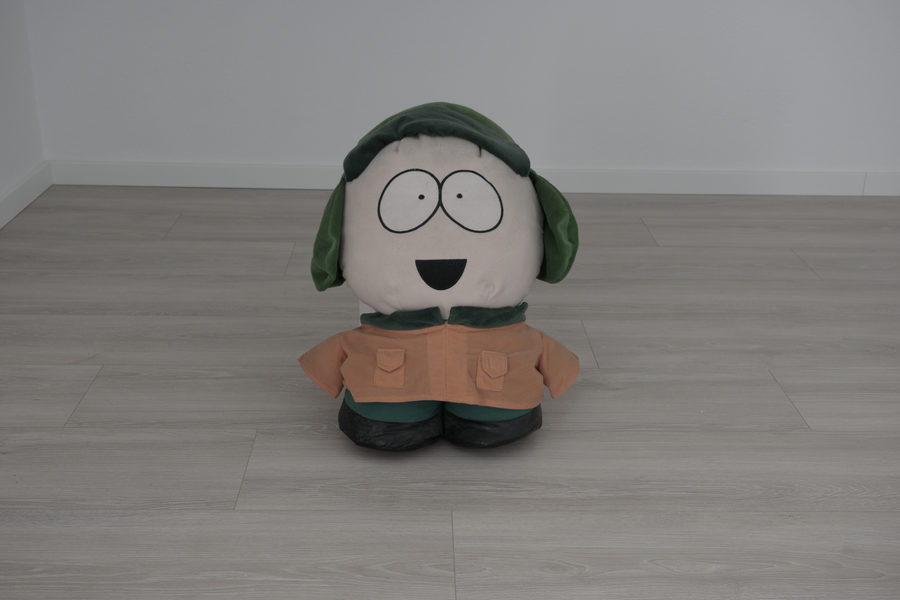

### 07 · 索尼 IN 拍立得

`中性  -4/-3  M1`

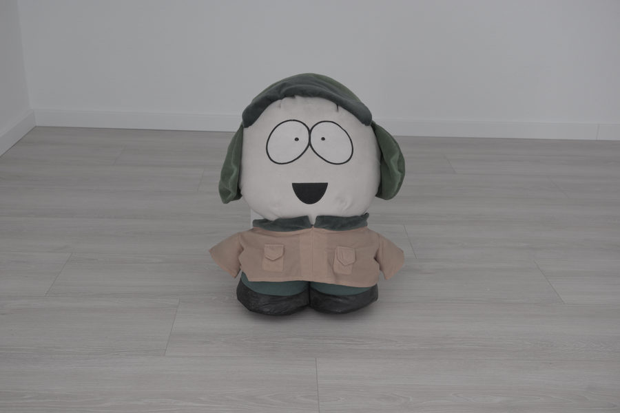

### 08 · 索尼 SH 柔和高调

`柔和高调 blue  +1.0  A1`

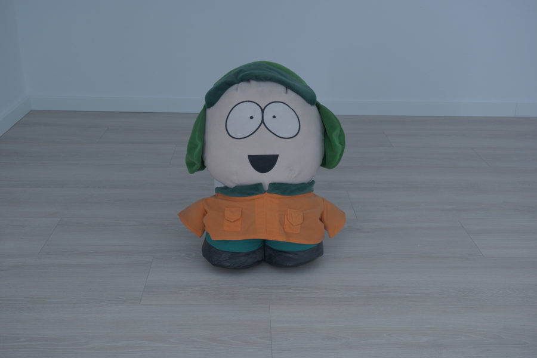

## 富士模拟

### 09 · 富士 Provia 标准

`标准  +1/0`

### 10 · 富士 Velvia 鲜艳

`鲜艳  +5/+2  MTX`

### 11 · 富士 Astia 柔和

`人像  0/-1  +0.3  A1`

### 12 · 经典正片 Classic Chrome

`标准  -1/+2  -0.3  A3  G1`

### 13 · 经典负片 Classic Negative

`标准  -3/+3  B1  G1`

### 14 · 怀旧负片 Nostalgic Neg

`标准  +1/0  A3`

### 15 · 富士 Reala Ace

`标准  0/+1`

### 16 · 专业负片 标准

`人像  -2/-1`

### 17 · 专业负片 高对比

`人像  -2/+1`

### 18 · 电影 Eterna

`中性  -4/-2  -0.3  DRO Lv3`

### 19 · 电影 电影 Eterna 跳漂

`中性  -6/+3  -0.3`

### 20 · Acros 黑白

`黑白  0/+1`

### 21 · Acros 黑白 黄滤镜

`黑白  0/+1  4000K`

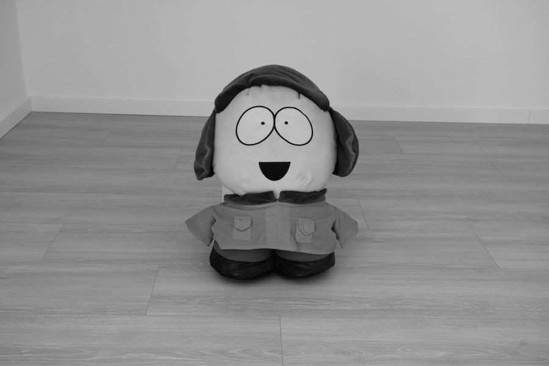

### 22 · Acros 黑白 红滤镜

`高对比黑白  2500K`

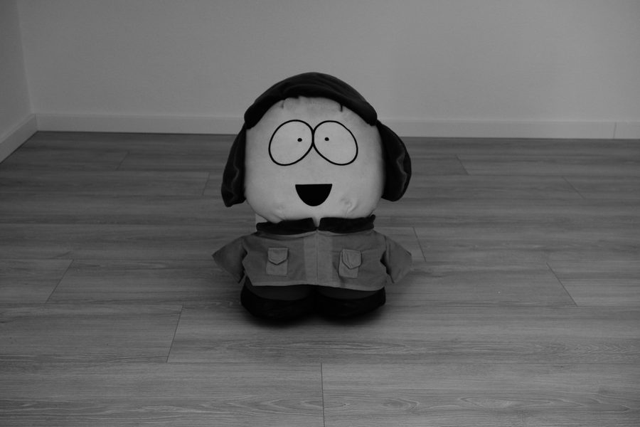

### 23 · Acros 黑白 绿滤镜

`黑白  0/+1  5600K  G4`

### 24 · 棕褐色

`棕褐色  0/0`

## 富士胶卷

### 25 · 富士 Pro 400H

`明亮  -2/-2  +0.7  B1  G1`

### 26 · 富士 Fortia 50

`鲜艳  +4/+2  MTX  -0.3  B1`

### 27 · 富士 Superia 400

`标准  +1/+1  +0.3  A1  G1`

### 28 · 富士 C200

`标准  0/0  B1  G1`

### 29 · 富士 Natura 1600

`人像  -2/-2  +0.3  A1`

## 柯达

### 30 · 柯达 Portra 160

`人像  -3/-2  +0.7  A1  M1`

### 31 · 柯达 Portra 400

`人像  -1/-1  +0.7  A3  G1`

### 32 · 柯达 Portra 800

`人像  -2/-2  +0.3  A1  G1`

### 33 · 柯达 Gold 200

`标准  +2/+1  +0.3  A3  G1`

### 34 · 柯达 Ultra Max 400

`标准  0/0  +0.3  G1`

### 35 · 柯达 Color Plus 200

`标准  +1/+1  +0.3  A2  G1`

### 36 · 柯达 Ektar 100

`标准  +3/+1  -0.3`

### 37 · 柯达 Ektachrome E100

`清晰  +3/+1  -0.3  B1`

### 38 · 柯达 Kodachrome 64

`深邃  +3/+2  -0.3  B1`

### 39 · 柯达 Vision3 500T 日光

`中性  -1/0  +0.3  DRO Lv3  3200K`

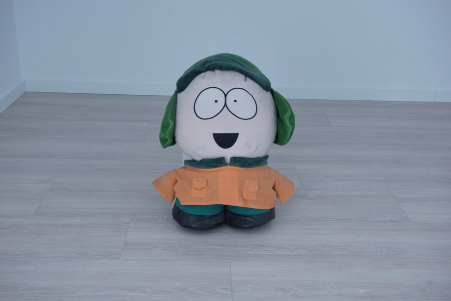

### 40 · 柯达 Vision 200T 小行星城

`中性  -2/-3  +0.3  DRO Lv3  5000K  A2  G3`

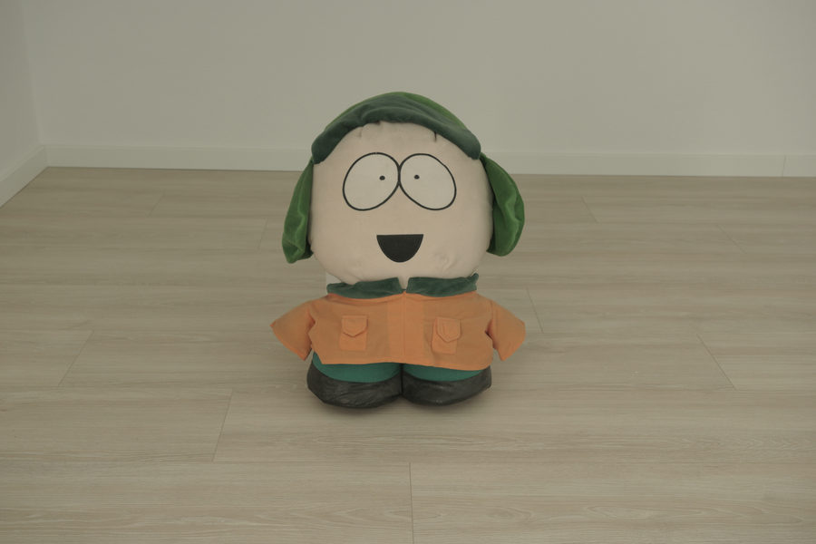

### 41 · 柯达 Tri-X 400

`黑白  0/+2  +0.3`

### 42 · 柯达 T-Max

`黑白  0/+2`

### 43 · 柯达 Tri-X 1600 迫冲

`高对比黑白  +0.3`

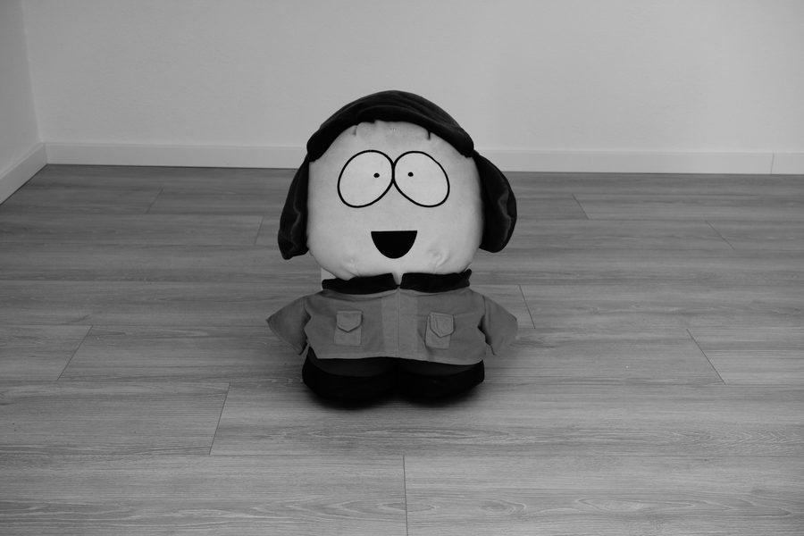

## 电影

### 44 · 电影still 50D 蓝丝绒

`标准  -2/-1  5500K  B1  M1`

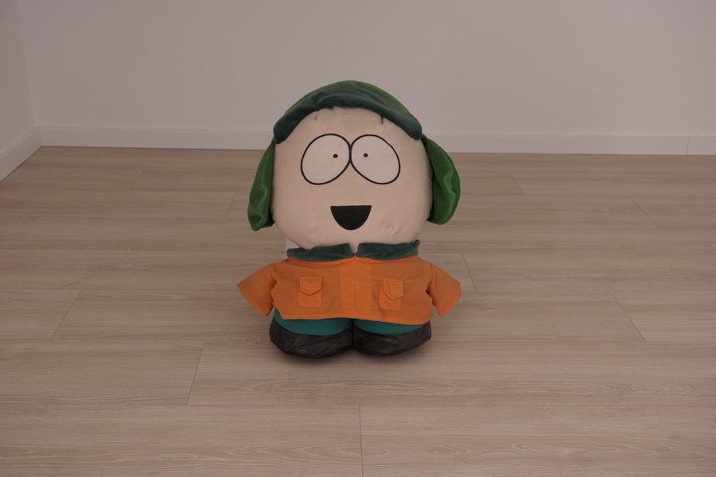

### 45 · 电影still 800T 钨丝灯

`中性  0/0  +0.3  3200K  M1`

### 46 · 经典电影

`标准  0/-1  DRO Lv3  6000K  A2`

### 47 · Rec709 低对比视频

`中性  -2/-2  DRO Lv5`

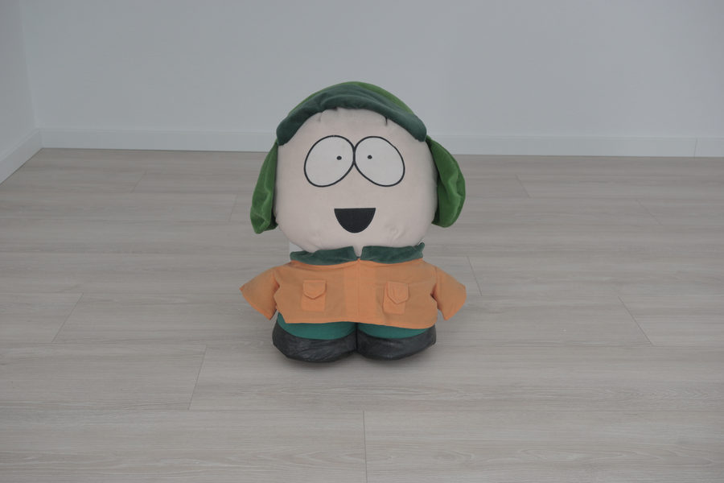

## 理光 GR

### 48 · 理光 GR 正片

`标准  +3/+2  -0.3  A2`

### 49 · 理光 GR 负片

`中性  -2/+1  +0.3  B1  G1`

### 50 · 理光 GR 跳漂

`中性  -6/+3`

### 51 · 理光 GR 复古

`复古照片  A3  M1`

### 52 · 理光 GR 交叉冲洗

`鲜艳  +2/+2  B2  G4`

### 53 · 理光 GR 高对比黑白

`高对比黑白`

### 54 · 理光 GR 硬调黑白

`黑白  0/+2`

### 55 · 理光 GR 柔调黑白

`黑白  0/-2`

## 徕卡

### 56 · 徕卡 现代

`标准  +1/+1`

### 57 · 徕卡 经典

`标准  -1/+2  A1`

### 58 · 徕卡 永恒

`中性  -3/-1  DRO Lv3  A1`

### 59 · 徕卡 黑白

`黑白  0/+2`

## 哈苏

### 60 · 哈苏 HNCS 自然

`中性  -1/-1`

## 佳能／尼康

### 61 · 佳能 标准

`标准  +1/+1  A1  M1`

### 62 · 佳能 人像

`人像  0/0  A1  M1`

### 63 · 佳能 忠实

`中性  0/0`

### 64 · 尼康 平淡

`中性  -3/-3  DRO Lv5`

### 65 · 尼康 鲜艳

`鲜艳  +1/+1`

## 松下／奥巴

### 66 · 松下 L.Monochrome D 黑白

`黑白  0/+3`

### 67 · 松下 L.ClassicNeo 经典

`中性  -3/-1  +0.3  A2`

### 68 · 奥林巴斯 波普艺术

`鲜艳  +8/+2  MTX`

### 69 · 奥林巴斯 淡雅明亮

`明亮  -3/-2  +0.7`

## 其他胶卷

### 70 · 爱克发 Vista 200

`标准  +2/+1  +0.3  A2  M1`

### 71 · 爱克发 Ultra 100

`鲜艳  +6/+1  MTX`

### 72 · 宝丽来／富士拍立得

`复古照片  +0.3  A1  M2`

## 伊尔福

### 73 · 伊尔福 HP5

`黑白  0/+1  +0.3`

### 74 · 伊尔福 FP4

`黑白  0/+1`

### 75 · 伊尔福 Delta 100

`黑白  0/+1`

### 76 · 伊尔福 Delta 3200

`黑白  0/+3  +0.7`

### 77 · 伊尔福 Pan F 50

`黑白  0/+2`

## 原始照片对照

样片按配方顺序拍摄，由相机自动命名。下表对应应用生成的 `samples.txt` 清单，并补上原始照片文件名。

| 序号 | 配方 | 品牌 | 参数 | 原文件 |
|---|---|---|---|---|
| 01 | 标准出厂 ST | 索尼 | `标准  0/0` | `DSC06567.JPG` |
| 02 | 索尼 PT 人像 | 索尼 | `人像  0/0` | `DSC06568.JPG` |
| 03 | 索尼 NT 中性 | 索尼 | `中性  0/0` | `DSC06569.JPG` |
| 04 | 索尼 VV 鲜艳 | 索尼 | `鲜艳  0/0` | `DSC06570.JPG` |
| 05 | 索尼 VV2 浓艳 | 索尼 | `鲜艳  +2/+1  MTX` | `DSC06571.JPG` |
| 06 | 索尼 FL 胶片 | 索尼 | `中性  -4/-1  A1` | `DSC06572.JPG` |
| 07 | 索尼 IN 拍立得 | 索尼 | `中性  -4/-3  M1` | `DSC06573.JPG` |
| 08 | 索尼 SH 柔和高调 | 索尼 | `柔和高调 blue  +1.0  A1` | `DSC06574.JPG` |
| 09 | 富士 Provia 标准 | 富士模拟 | `标准  +1/0` | `DSC06575.JPG` |
| 10 | 富士 Velvia 鲜艳 | 富士模拟 | `鲜艳  +5/+2  MTX` | `DSC06576.JPG` |
| 11 | 富士 Astia 柔和 | 富士模拟 | `人像  0/-1  +0.3  A1` | `DSC06577.JPG` |
| 12 | 经典正片 Classic Chrome | 富士模拟 | `标准  -1/+2  -0.3  A3  G1` | `DSC06578.JPG` |
| 13 | 经典负片 Classic Negative | 富士模拟 | `标准  -3/+3  B1  G1` | `DSC06579.JPG` |
| 14 | 怀旧负片 Nostalgic Neg | 富士模拟 | `标准  +1/0  A3` | `DSC06580.JPG` |
| 15 | 富士 Reala Ace | 富士模拟 | `标准  0/+1` | `DSC06581.JPG` |
| 16 | 专业负片 标准 | 富士模拟 | `人像  -2/-1` | `DSC06582.JPG` |
| 17 | 专业负片 高对比 | 富士模拟 | `人像  -2/+1` | `DSC06583.JPG` |
| 18 | 电影 Eterna | 富士模拟 | `中性  -4/-2  -0.3  DRO Lv3` | `DSC06584.JPG` |
| 19 | 电影 电影 Eterna 跳漂 | 富士模拟 | `中性  -6/+3  -0.3` | `DSC06585.JPG` |
| 20 | Acros 黑白 | 富士模拟 | `黑白  0/+1` | `DSC06586.JPG` |
| 21 | Acros 黑白 黄滤镜 | 富士模拟 | `黑白  0/+1  4000K` | `DSC06587.JPG` |
| 22 | Acros 黑白 红滤镜 | 富士模拟 | `高对比黑白  2500K` | `DSC06588.JPG` |
| 23 | Acros 黑白 绿滤镜 | 富士模拟 | `黑白  0/+1  5600K  G4` | `DSC06589.JPG` |
| 24 | 棕褐色 | 富士模拟 | `棕褐色  0/0` | `DSC06590.JPG` |
| 25 | 富士 Pro 400H | 富士胶卷 | `明亮  -2/-2  +0.7  B1  G1` | `DSC06591.JPG` |
| 26 | 富士 Fortia 50 | 富士胶卷 | `鲜艳  +4/+2  MTX  -0.3  B1` | `DSC06592.JPG` |
| 27 | 富士 Superia 400 | 富士胶卷 | `标准  +1/+1  +0.3  A1  G1` | `DSC06593.JPG` |
| 28 | 富士 C200 | 富士胶卷 | `标准  0/0  B1  G1` | `DSC06594.JPG` |
| 29 | 富士 Natura 1600 | 富士胶卷 | `人像  -2/-2  +0.3  A1` | `DSC06595.JPG` |
| 30 | 柯达 Portra 160 | 柯达 | `人像  -3/-2  +0.7  A1  M1` | `DSC06596.JPG` |
| 31 | 柯达 Portra 400 | 柯达 | `人像  -1/-1  +0.7  A3  G1` | `DSC06597.JPG` |
| 32 | 柯达 Portra 800 | 柯达 | `人像  -2/-2  +0.3  A1  G1` | `DSC06598.JPG` |
| 33 | 柯达 Gold 200 | 柯达 | `标准  +2/+1  +0.3  A3  G1` | `DSC06599.JPG` |
| 34 | 柯达 Ultra Max 400 | 柯达 | `标准  0/0  +0.3  G1` | `DSC06600.JPG` |
| 35 | 柯达 Color Plus 200 | 柯达 | `标准  +1/+1  +0.3  A2  G1` | `DSC06601.JPG` |
| 36 | 柯达 Ektar 100 | 柯达 | `标准  +3/+1  -0.3` | `DSC06602.JPG` |
| 37 | 柯达 Ektachrome E100 | 柯达 | `清晰  +3/+1  -0.3  B1` | `DSC06603.JPG` |
| 38 | 柯达 Kodachrome 64 | 柯达 | `深邃  +3/+2  -0.3  B1` | `DSC06604.JPG` |
| 39 | 柯达 Vision3 500T 日光 | 柯达 | `中性  -1/0  +0.3  DRO Lv3  3200K` | `DSC06605.JPG` |
| 40 | 柯达 Vision 200T 小行星城 | 柯达 | `中性  -2/-3  +0.3  DRO Lv3  5000K  A2  G3` | `DSC06606.JPG` |
| 41 | 柯达 Tri-X 400 | 柯达 | `黑白  0/+2  +0.3` | `DSC06607.JPG` |
| 42 | 柯达 T-Max | 柯达 | `黑白  0/+2` | `DSC06608.JPG` |
| 43 | 柯达 Tri-X 1600 迫冲 | 柯达 | `高对比黑白  +0.3` | `DSC06609.JPG` |
| 44 | 电影still 50D 蓝丝绒 | 电影 | `标准  -2/-1  5500K  B1  M1` | `DSC06610.JPG` |
| 45 | 电影still 800T 钨丝灯 | 电影 | `中性  0/0  +0.3  3200K  M1` | `DSC06611.JPG` |
| 46 | 经典电影 | 电影 | `标准  0/-1  DRO Lv3  6000K  A2` | `DSC06612.JPG` |
| 47 | Rec709 低对比视频 | 电影 | `中性  -2/-2  DRO Lv5` | `DSC06613.JPG` |
| 48 | 理光 GR 正片 | 理光 GR | `标准  +3/+2  -0.3  A2` | `DSC06614.JPG` |
| 49 | 理光 GR 负片 | 理光 GR | `中性  -2/+1  +0.3  B1  G1` | `DSC06615.JPG` |
| 50 | 理光 GR 跳漂 | 理光 GR | `中性  -6/+3` | `DSC06616.JPG` |
| 51 | 理光 GR 复古 | 理光 GR | `复古照片  A3  M1` | `DSC06617.JPG` |
| 52 | 理光 GR 交叉冲洗 | 理光 GR | `鲜艳  +2/+2  B2  G4` | `DSC06618.JPG` |
| 53 | 理光 GR 高对比黑白 | 理光 GR | `高对比黑白` | `DSC06619.JPG` |
| 54 | 理光 GR 硬调黑白 | 理光 GR | `黑白  0/+2` | `DSC06620.JPG` |
| 55 | 理光 GR 柔调黑白 | 理光 GR | `黑白  0/-2` | `DSC06621.JPG` |
| 56 | 徕卡 现代 | 徕卡 | `标准  +1/+1` | `DSC06622.JPG` |
| 57 | 徕卡 经典 | 徕卡 | `标准  -1/+2  A1` | `DSC06623.JPG` |
| 58 | 徕卡 永恒 | 徕卡 | `中性  -3/-1  DRO Lv3  A1` | `DSC06624.JPG` |
| 59 | 徕卡 黑白 | 徕卡 | `黑白  0/+2` | `DSC06625.JPG` |
| 60 | 哈苏 HNCS 自然 | 哈苏 | `中性  -1/-1` | `DSC06626.JPG` |
| 61 | 佳能 标准 | 佳能／尼康 | `标准  +1/+1  A1  M1` | `DSC06627.JPG` |
| 62 | 佳能 人像 | 佳能／尼康 | `人像  0/0  A1  M1` | `DSC06628.JPG` |
| 63 | 佳能 忠实 | 佳能／尼康 | `中性  0/0` | `DSC06629.JPG` |
| 64 | 尼康 平淡 | 佳能／尼康 | `中性  -3/-3  DRO Lv5` | `DSC06630.JPG` |
| 65 | 尼康 鲜艳 | 佳能／尼康 | `鲜艳  +1/+1` | `DSC06631.JPG` |
| 66 | 松下 L.Monochrome D 黑白 | 松下／奥巴 | `黑白  0/+3` | `DSC06632.JPG` |
| 67 | 松下 L.ClassicNeo 经典 | 松下／奥巴 | `中性  -3/-1  +0.3  A2` | `DSC06633.JPG` |
| 68 | 奥林巴斯 波普艺术 | 松下／奥巴 | `鲜艳  +8/+2  MTX` | `DSC06634.JPG` |
| 69 | 奥林巴斯 淡雅明亮 | 松下／奥巴 | `明亮  -3/-2  +0.7` | `DSC06635.JPG` |
| 70 | 爱克发 Vista 200 | 其他胶卷 | `标准  +2/+1  +0.3  A2  M1` | `DSC06636.JPG` |
| 71 | 爱克发 Ultra 100 | 其他胶卷 | `鲜艳  +6/+1  MTX` | `DSC06637.JPG` |
| 72 | 宝丽来／富士拍立得 | 其他胶卷 | `复古照片  +0.3  A1  M2` | `DSC06638.JPG` |
| 73 | 伊尔福 HP5 | 伊尔福 | `黑白  0/+1  +0.3` | `DSC06639.JPG` |
| 74 | 伊尔福 FP4 | 伊尔福 | `黑白  0/+1` | `DSC06640.JPG` |
| 75 | 伊尔福 Delta 100 | 伊尔福 | `黑白  0/+1` | `DSC06641.JPG` |
| 76 | 伊尔福 Delta 3200 | 伊尔福 | `黑白  0/+3  +0.7` | `DSC06642.JPG` |
| 77 | 伊尔福 Pan F 50 | 伊尔福 | `黑白  0/+2` | `DSC06643.JPG` |
